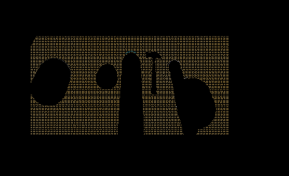

## Project: Perception Pick & Place
### Writeup Template: You can use this file as a template for your writeup if you want to submit it as a markdown file, but feel free to use some other method and submit a pdf if you prefer.

---


# Required Steps for a Passing Submission:
1. Extract features and train an SVM model on new objects (see `pick_list_*.yaml` in `/pr2_robot/config/` for the list of models you'll be trying to identify).
2. Write a ROS node and subscribe to `/pr2/world/points` topic. This topic contains noisy point cloud data that you must work with.
3. Use filtering and RANSAC plane fitting to isolate the objects of interest from the rest of the scene.
4. Apply Euclidean clustering to create separate clusters for individual items.
5. Perform object recognition on these objects and assign them labels (markers in RViz).
6. Calculate the centroid (average in x, y and z) of the set of points belonging to that each object.
7. Create ROS messages containing the details of each object (name, pick_pose, etc.) and write these messages out to `.yaml` files, one for each of the 3 scenarios (`test1-3.world` in `/pr2_robot/worlds/`).  [See the example `output.yaml` for details on what the output should look like.](https://github.com/udacity/RoboND-Perception-Project/blob/master/pr2_robot/config/output.yaml)  
8. Submit a link to your GitHub repo for the project or the Python code for your perception pipeline and your output `.yaml` files (3 `.yaml` files, one for each test world).  You must have correctly identified 100% of objects from `pick_list_1.yaml` for `test1.world`, 80% of items from `pick_list_2.yaml` for `test2.world` and 75% of items from `pick_list_3.yaml` in `test3.world`.
9. Congratulations!  Your Done!

# Extra Challenges: Complete the Pick & Place
7. To create a collision map, publish a point cloud to the `/pr2/3d_map/points` topic and make sure you change the `point_cloud_topic` to `/pr2/3d_map/points` in `sensors.yaml` in the `/pr2_robot/config/` directory. This topic is read by Moveit!, which uses this point cloud input to generate a collision map, allowing the robot to plan its trajectory.  Keep in mind that later when you go to pick up an object, you must first remove it from this point cloud so it is removed from the collision map!
8. Rotate the robot to generate collision map of table sides. This can be accomplished by publishing joint angle value(in radians) to `/pr2/world_joint_controller/command`
9. Rotate the robot back to its original state.
10. Create a ROS Client for the “pick_place_routine” rosservice.  In the required steps above, you already created the messages you need to use this service. Checkout the [PickPlace.srv](https://github.com/udacity/RoboND-Perception-Project/tree/master/pr2_robot/srv) file to find out what arguments you must pass to this service.
11. If everything was done correctly, when you pass the appropriate messages to the `pick_place_routine` service, the selected arm will perform pick and place operation and display trajectory in the RViz window
12. Place all the objects from your pick list in their respective dropoff box and you have completed the challenge!
13. Looking for a bigger challenge?  Load up the `challenge.world` scenario and see if you can get your perception pipeline working there!

## [Rubric](https://review.udacity.com/#!/rubrics/1067/view) Points
### Here I will consider the rubric points individually and describe how I addressed each point in my implementation.  

---
### Writeup / README


#### 1. Provide a Writeup / README that includes all the rubric points and how you addressed each one.  You can submit your writeup as markdown or pdf.  

You're reading it!

### Exercise 1, 2 and 3 pipeline implemented
#### 1. Complete Exercise 1 steps. Pipeline for filtering and RANSAC plane fitting implemented.

  * In order to improve computation time, the full resolution point cloud was downsampled. By setting the leaf size/voxel size (in meters) to 0.01 which was determined to be the optimal value, the following image was obtained:

    

  * The downsampled voxel was then went through a passthrough filter to only retain useful information, by focusing on a particular *region of interest*. Applying filter over the z-axis (which is height of table) , and setting the minimum and maximum axis to 0.6 and 1.1 respectively, we obtained the following:

    

  * Next step is to remove the table from the scene so that only objects on the table are shown! This is done by using a technique called *Random Sample Consensus* or "RANSAC".
    * By utilizing point cloud library's SACMODEL_PLANE (http://docs.pointclouds.org/1.7.0/group__sample__consensus.html), to determine plane models, the table is treated as "inliers", and hence the objects on the tables can extracted as "outliers".
    * Setting max_distance to 0.01 yield the following point cloud which shows the table only:

      

    * Figure below shows point cloud with objects on table only.

      


#### 2. Complete Exercise 2 steps: Pipeline including clustering for segmentation implemented.  
For clustering, Euclidean Clustering or DBSCAN (Density-Based Spatial Clustering of Applications with Noise) algorithm is used in favor of K-means clustering (which expects number of cluster as input), as we have no idea how many clusters to expect in the data but know something about how the points should be clustered in terms of density (distance between points in a cluster).

By setting cluster tolerance, min cluster size and max cluster size to *0.015*, *20* and *1500* respectively through trial and error, following image is presented:


From slack discussion:

* 'tolerance' is how close adjacent points have to be to be considered as part of same cluster.  By setting the tolerance to a large number, two adjacent objects may get counted as one cluster, while setting it too small then points that should belong to a certain object's cluster may not get added to that cluster.

* Max cluster size is the most number of spots in a cluster, which gets multiplied with the leaf size to produce the cluster object in one direction.


#### 3. Complete Exercise 3 Steps.  Features extracted and SVM trained.  Object recognition implemented.

By setting the appropriate *GAZEBO_MODEL_PATH* (in this case "~/catkin_ws/src/sensor_stick/models"), we can run feature capturing for models defined in the folder:

```
robond@udacity:~/catkin_ws/src/sensor_stick/models$ ls
arm_part  beer  biscuits  book  bowl  create  disk_part  eraser  glue  hammer  plastic_cup  snacks  soap  soap2  soda_can  sticky_notes
```

We then run feature capature on models defined in "capture_features.py" for models below:

```
models = [\
    'beer',
    'bowl',
    'create',
    'disk_part',
    'hammer',
    'plastic_cup',
    'soda_can']
```

 
 


Exercise_3_before_improve


*88%* accuracy achieved after change to using *HSV* (compute_color_histograms, using_hsv=True), increase loop to *25*, and use *RBF* kernel


### Pick and Place Setup

#### 1. For all three tabletop setups (`test*.world`), perform object recognition, then read in respective pick list (`pick_list_*.yaml`). Next construct the messages that would comprise a valid `PickPlace` request output them to `.yaml` format.


Spend some time at the end to discuss your code, what techniques you used, what worked and why, where the implementation might fail and how you might improve it if you were going to pursue this project further.  

* By importing most of the code implemented from Exercise 1, 2 and 3, we only need to update the "pr2_mover()" routine which we are required to output the *.yaml file* with the following parameters:
1. test_scene_num
2. arm_name
3. object_name
4. pick_pose
5. place_pose


* The following code are commented to prevent pick and place action from robot, as \*.yaml file will be modified after robot do a successful pickup for certain case.

``` python
#TODO: Insert your message variables to be sent as a service request
resp = pick_place_routine(test_scene_num, object_name, arm_name, pick_pose, place_pose)
```
